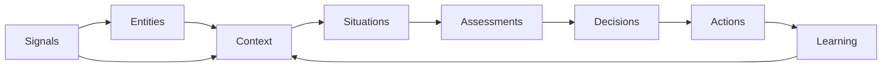

# Operational Objects

Operational Objects are the shared conceptual model passed through the Operational Understanding Loop. Future Runtime services should consume and produce these objects instead of arbitrary payloads whenever practical and backward-compatible.

## Canonical objects

| Object | Definition | Examples |
| --- | --- | --- |
| Signal | A raw, attributable observation. | Event, reading, message, file change, connector result |
| Entity | An identifiable operational subject. | Person, asset, device, system, organization, connector |
| Context | Governed relationships among entities, signals, constraints, and prior state. | Tenant mission, system dependency, policy scope |
| Situation | A time-bounded operational state assembled from Context and Signals. | Service degradation, approval backlog, project risk |
| Assessment | NEXUS evaluation of a Situation, including uncertainty and evidence. | Impact assessment, readiness evaluation, risk judgment |
| Decision | A governed operational conclusion with authority and rationale. | Approve, deny, defer, escalate, request evidence |
| Action | Bounded work proposed, staged, executed, or verified. | Notify, create plan, invoke connector, execute workflow |
| Learning | A preserved lesson derived from outcomes and evidence. | Prediction variance, effective mitigation, policy gap |

## Object flow

## Required semantics

Where applicable, an Operational Object records:

- Stable object and schema identifiers
- Object type and lifecycle state
- Tenant, workspace, and subject scope
- Source classification and provenance
- Creation, observation, freshness, and expiry times
- Confidence and uncertainty
- Evidence and proof references
- Authority, policy, and approval references
- Parent and related object references
- Receipt and postcondition references for executed Actions

## Truth boundaries

An object may be missing or partially known. Consumers must not silently invent fields, upgrade confidence, convert model-native output into evidence, treat a proposed Action as executed, or treat an executed Action as verified without a postcondition.

Compatibility adapters may translate existing payloads to Operational Objects at governed boundaries. Existing API contracts and schemas remain stable until separately versioned.
