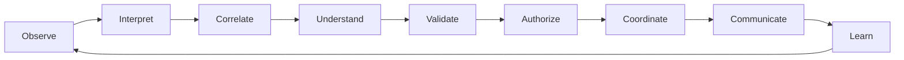

# Operational Understanding Loop

The Operational Understanding Loop is the continuous cognitive lifecycle of NEXUS:

No single component owns the loop. Operational Capabilities contribute specialized behavior while the Runtime Foundation provides shared services and Operational Objects carry state between contributions.

## Lifecycle semantics

| Stage | Meaning | Typical object transition |
| --- | --- | --- |
| Observe | Capture registered operational signals without interpretation. | Signal created or updated |
| Interpret | Classify meaning candidates and normalize observations. | Signal associated with Entities |
| Correlate | Relate observations across time, systems, and entities. | Context assembled |
| Understand | Form a bounded view of the current operational state. | Situation and Assessment formed |
| Validate | Challenge evidence, uncertainty, dissent, and alternatives. | Assessment confidence qualified |
| Authorize | Apply policy, identity, authority, approval, and risk controls. | Decision governed |
| Coordinate | Plan and sequence allowed work across capabilities and actors. | Actions staged or dispatched |
| Communicate | Present the right explanation, request, or briefing to the right audience. | Decisions and Actions rendered |
| Learn | Compare outcomes with expectations and preserve lessons. | Learning object recorded |

## Executive expression

The Executive Operating Loop is a simplified, executive-facing projection of this lifecycle. The Executive Operational Experience renders that projection. Neither client presentation nor the projection changes Runtime truth.

## Continuity and truth

The loop is continuous but not automatic authority. A lifecycle may stop at any stage when evidence, policy, identity, capability, or approval is missing. Pending remains pending, and an unverified Action never becomes a verified outcome through presentation alone.
