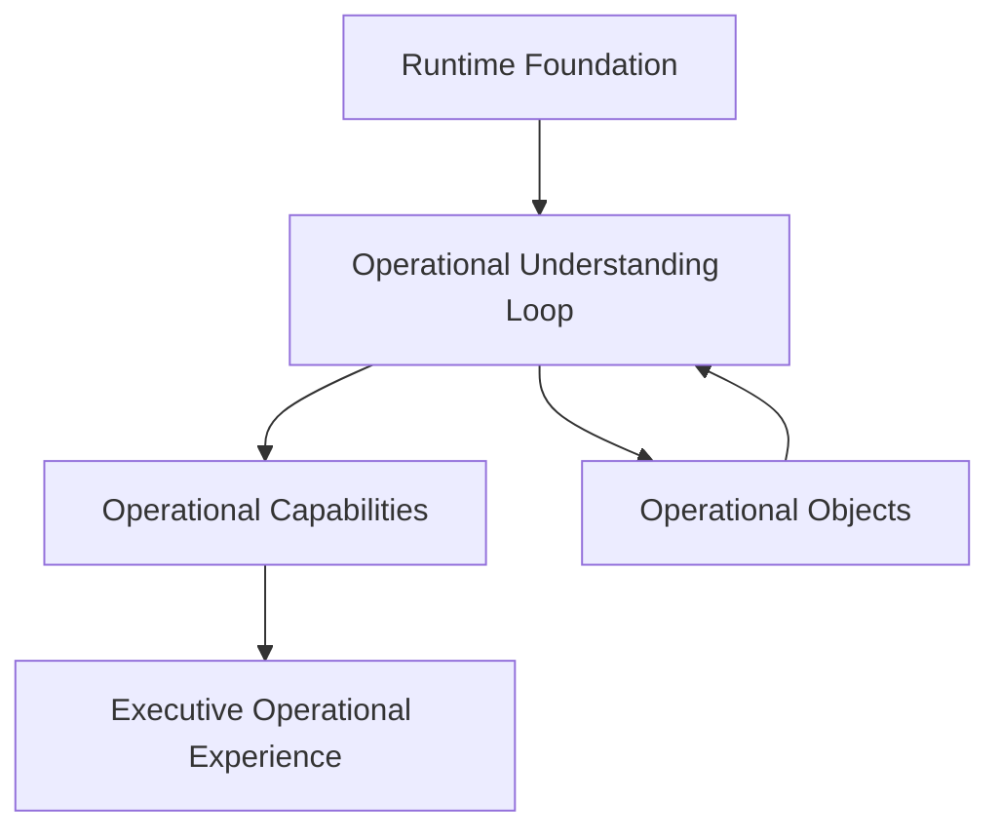

# NEXUS Operational Understanding Platform

NEXUS is an Operational Understanding Platform. It converts registered observations and evidence into governed understanding, bounded decisions, coordinated action, executive communication, and learning without collapsing the truth boundaries between those states.

This model supersedes the former six-layer architecture as the canonical conceptual organization of the platform. Existing implementation names, endpoints, schemas, and persisted identifiers remain compatible until a separately reviewed migration is justified.

## Canonical architectural domains

1. **Runtime Foundation** — the shared substrate for every capability.
2. **Operational Understanding Loop** — the continuous cognitive lifecycle from observation through learning.
3. **Operational Capabilities** — six composable responsibilities that contribute to the loop.
4. **Operational Objects** — the shared objects that capabilities consume, enrich, govern, and produce.



The diagram is a dependency and participation model, not a stack of processing layers. Capabilities can participate at several points in the loop, and no capability owns the complete lifecycle.

## Architectural invariants

- Runtime remains authoritative for operational truth, context assembly, policy, capability state, evidence, proof, receipts, and governed execution.
- Clients own presentation and interaction surfaces, not operational understanding or authority.
- The Runtime Foundation underpins capabilities but is not itself an operational capability.
- Operational Objects preserve provenance, classification, confidence, freshness, authority, and evidence references.
- Unknown, inferred, recommended, authorized, executed, and verified states remain distinct.
- Execution claims require proof, a receipt, and postcondition verification.
- Model-native reasoning remains probabilistic and never becomes Runtime evidence merely because it was generated.

## Executive-facing relationship

The Executive Operating Loop remains valid. It is the executive-facing visualization of the broader platform lifecycle:

```text
Operational Understanding Loop
    ↓
Executive Operating Loop
    ↓
Executive Operational Experience
```

The Executive Operating Loop simplifies the platform lifecycle for executive use; it does not replace the deeper Runtime model.

## Related documents

- [Runtime Foundation](Runtime_Foundation.md)
- [Operational Understanding Loop](Operational_Understanding_Loop.md)
- [Operational Capabilities](Operational_Capabilities.md)
- [Operational Objects](Operational_Objects.md)
- [Architecture Glossary](Architecture_Glossary.md)
- [NEXUS Platform Constitution](NEXUS_Platform_Constitution.md)
- [ADR-0004](../adr/ADR-0004-operational-understanding-platform.md)
